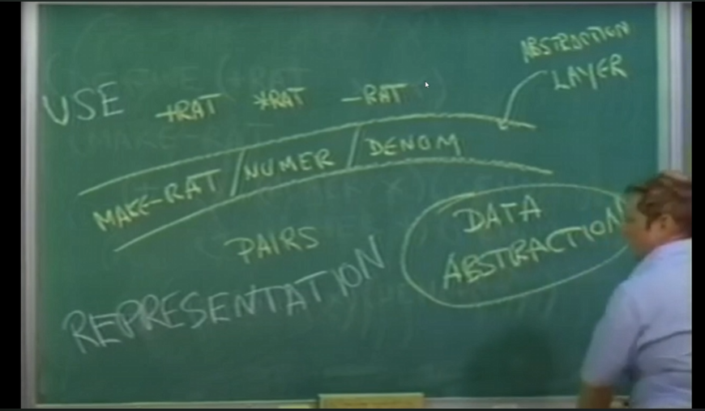

let `cloud of N & D` be `x`

This is a "constuctor": (MAKE-RAT `N` `D`) -> `x`

This is a "selector": (NUM `x`) -> `N`

> Why use data abstraction?

: Modularity, Encapsulation,Flexibility, Reuseability , Maintainability , Understanding

Example of data abstraction in layers (reduces complexity in implementation)

