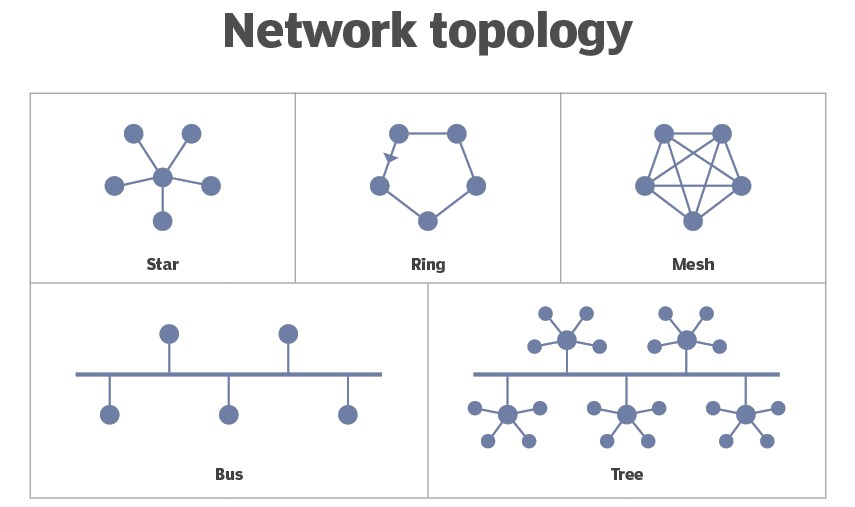

# ?

- ssl?
- subnetting
- load balancing

# IP Address (Internet Protocol)

> *A unique numerical label assigned to a device on a network for identification and communication purposes.*
> 

Modem/Router has IP address

Each device has a IP address 

---

# Ports

> *A numeric value that directs network traffic to specific applications or services running on a device.*
> 

A port is a communication endpoint within an operating system , 

help direct incoming network traffic to the appropriate application or service

## Reserved Ports

0 -1023

Reserved Ports , cannot be used by other applications

- HTTP = Port 80
- HTTPS = Port 443

1024 - 49152

For specific applications

- MongoDB = 27017
- SQL = 1433

---

# Bandwidth

1kbps = 1 000 bits/s

1mbps = 1 000 000 bits/s

1gbps = 10^9 bits/s

---

# Network Types

| **Network Type** | **Description** |
| --- | --- |
| Personal Area Network (PAN) | Connects devices in close proximity to an individual. |
| Local Area Network (LAN) | Covers a limited geographical area like a home or office. |
| Metropolitan Area Network (MAN) | Spans a larger geographical area, typically a city. |
| Wide Area Network (WAN) | Covers a wide geographic area, such as multiple cities/countries. |
| Campus Area Network (CAN) | Interconnects LANs within a campus or large organization. |
| Storage Area Network (SAN) | Connects storage devices to servers for high-speed data access. |
| Wireless Local Area Network (WLAN) | LAN using wireless connections like Wi-Fi. |
| Virtual Private Network (VPN) | Creates secure connections over a public network for remote access. |
| Intranet | Private network for internal communication and collaboration. |
| Extranet | Extends intranet to include external parties with limited access. |
| Cloud Network | Connects and provides access to cloud computing services. |
| Internet | Global network of interconnected networks for worldwide communication. |

---

# Modem & Router

Modem 

> Modulate digital data to analog signal to be transferred
Demodulate analog signal to digital data for computer to understand

*A device that connects your network to the internet by translating signals between your computer and the internet service provider (ISP).*
> 

Router

> Route data packets to devices

*A device that connects multiple devices within a network, directing data traffic and facilitating communication between those devices.*
> 

---

# Network Topologies

> Physical and logical arrangement of devices in a network
> 

---

# Architectures

## Client Server Architecture

## Peer to peer architecture

application layer