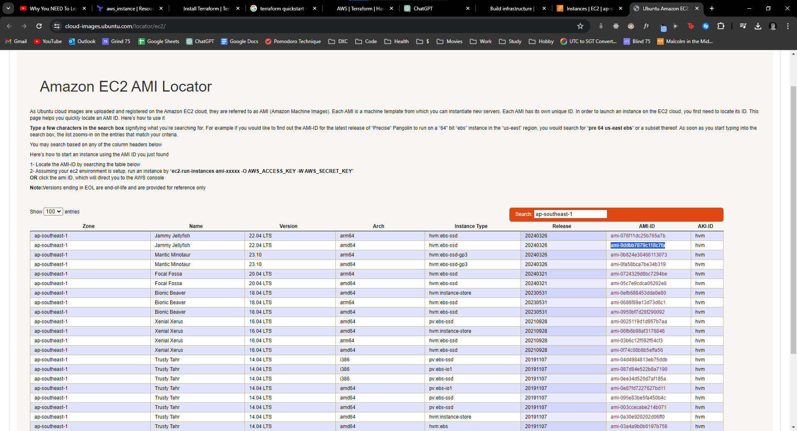
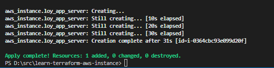
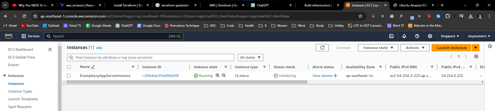

install terraform

install aws cli

go to aws console , go to security credentials, get/create access keys

use `aws configure` to configure access keys to .aws/credentials in to default group

create terraform folder

create main.tf file in folder:

- provider block , aws
- resources block , ec2 instance

```tf
provider "aws" {
  profile = "default"
}


resource "aws_instance" "loy_app_server" {
  ami           = "ami-0ddbb7879c118c7fa"
  instance_type = "t2.micro"

  tags = {
    Name = "ExampleLoyAppServerInstance"
  }
}
```

get ami from 



after running using `terraform apply` 
