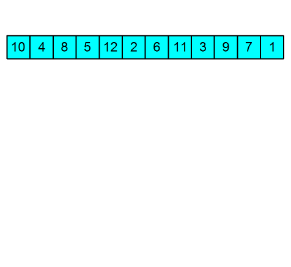

# Heap sort

## Step 1: Create a heap

| Ascending Order | Max Heap |
| --- | --- |
| Descending Order | Min Heap |

Eg. Max Heap used here 

**Heapify** is the process of creating a heap data structure from a binary tree

## Step 2: 
Root of heap will be inserted from last to first index repeatedly

- Time complexity : $O(nlogn)$
- Space complexity : $O(1)$ (in-place sorting algorithm)
    
    → Data in an array can be rearranged into a heap , so no data actually needs to be stored anywhere else
    
- Unstable