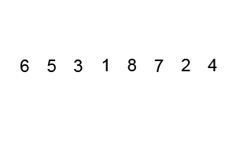

# Quick sort

[Quick Sort - Data Structures & Algorithms Tutorial Python #15](https://www.youtube.com/watch?v=5iSZ7mh_RAk)

Pivot : 

The value within the partitioning space that I want to find a position for

Partitioning:

Putting pivot in its right position , partitions lesser at left and greater at right

---

## Hoare Partition

---

## Lomuto Partition

???

---

# Steps

1. Make partition for current range 
2. Recursively call quickSort for left partition and right partition

---

- Time complexity : $O(n^2)$ (Bad pivot selection)  
OR
$θ(nlogn)$ (Average: logn for swaps for n elements)
- Space complexity : $O(logn)$
- A Divide & Conquer algorithm
- Recursive
- Unstable