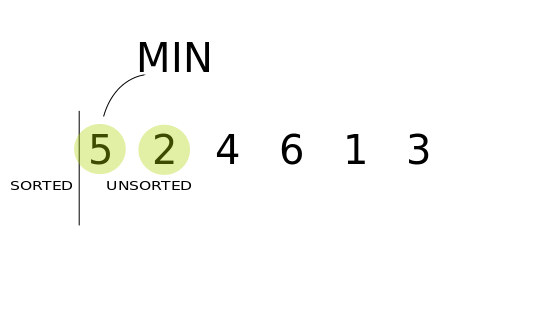

# Selection sort

→ Find smallest → Swap with index at start of search




- Time complexity : $O(n^2)$
- Unstable
    
    
    


```python
def selectionSort(arr):
    n = len(arr)
    
    for i in range(n):
        minIndex = i
        
        for j in range(i+1,n):
            if arr[j]<arr[minIndex]:
                minIndex = j
                
        if i != minIndex:
            arr[i],arr[minIndex] = arr[minIndex],arr[i]
```