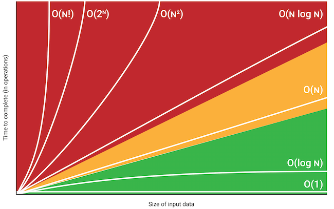

# Time / Space Complexity

---

# Asymptotic Notation

Big-oh notation (upper bound)

Theta notation (average bound)

Omega notation (lowerbound)

---

# Time Complexity

 

**HOW DOES ALGORITHM SPEED SCALE AS INPUT SCALES?**

To get time complexity :

- Drop lower order terms
- Drop all constant multipliers

> $T(n)=2n^2+3n+1=O(n)$
> 

Constant time , Logarithmic time , Linear time , Quadratic time , Exponential time , Factorial time

---

# Space complexity

**HOW DOES THE SPACE USAGE SCALE AS INPUT SCALES?**

---

# Time to Space trade-off / relationship

Time ↑ Space ↓

**OR**

Time ↑ Space ↓

Which ? Choose time or space ? 

Answer : Usually “ Time ↑ Space ↓ “ 

Because we can buy memory for space but not time