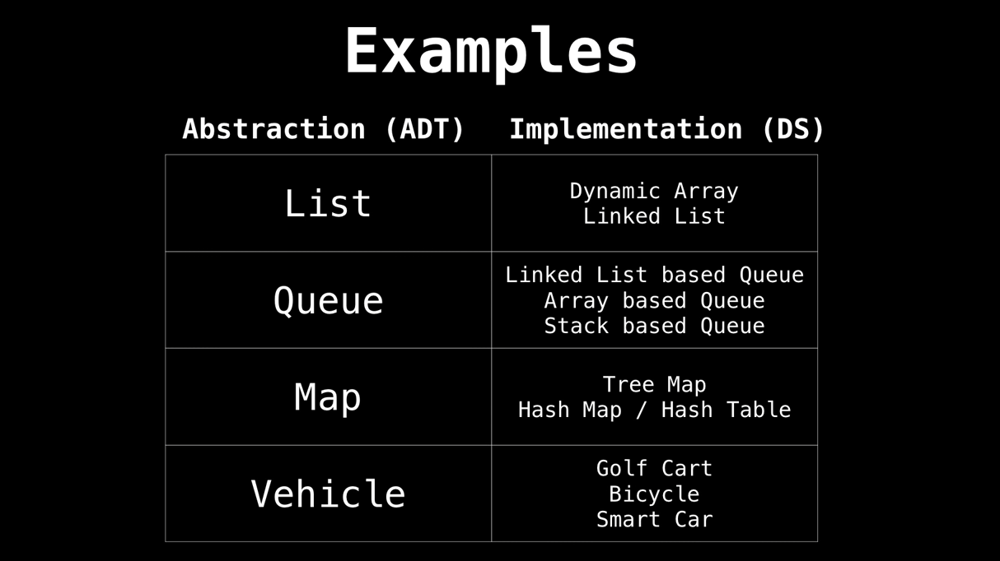

# Data Structures I actually need

# Abstract Data Type (ADT)

## Priority Queue

- Similar to a queue but each element has a priority
- An element with high priority is dequeued (lowest number = highest priority)

eg . Implement priority queue using a binary heap 
( because heaps have best possible time complexity)

---

# Arrays

*In Python, list is implemented as dynamic array, in other languages like Java, C++ there are both dynamic and static arrays

## Static Array

> Fixed length container which indexable n elements from [0,n-1]
> 

## Dynamic Array

> An array with automatic resizing
> 

|  | Static Array | Dynamic Array |  |
| --- | --- | --- | --- |
| Access | O(1) | O(1) | Access by index |
| Search | O(n) | O(n) | Traverse through array |
| Insertion | NA | O(n) | Have to shift all elements to right after insertion |
| Appending | NA | O(1) | Add to end  |
| Deletion | NA | O(n) | Have to shift elements after deletion  |

---

# Linked lists

Sequential list of vertices that hold data and point to other vertices that also hold data

## Terminology

| Head  | First node  |
| --- | --- |
| Tail | Last node |
| Pointer | reference to another node |
| Node | Object containing data and pointer |

## Singly Linked List

Only hold a reference to the next node

### Inserting into Singly

- Example
    
    
    
    
    
    
    

### Removing from Singly

- Example
    
    
    
    
    
    
    
    
    

## Doubly Linked List

Hold a reference to the next and previous

### Inserting into Doubly

- Example
    
    
    
    
    

### Removing from Doubly

- Example
    
    
    
    
    
    4’s pointer to 15
    
    
    
    15’s previous pointer to 4
    
    
    

|  | Pros | Cons |
| --- | --- | --- |
| Singly | Use less memory (pointers use memory)

Simpler Implementation | Cannot easily access previous elements
(Traverse from head to previous node)
 |
| Doubly | Can be traversed backwards | Takes 2x memory |

---

# Stack

Stores items in a **Last-In/First-Out (LIFO) or First-In/Last-Out (FILO) manner**

One-ended linear data structure with two primary operations : push & pop

## Implementation

- list
- Linked list
- Collections.deque ✅
- queue.LifoQueue

---

# Queue

Stores items in a **First-In/First-Out (FIFO) manner**

Linear data structure which models a queue with two primary operations: enqueue & dequeue

## Implementation

- list ❌
- collections.deque ✅
- queue.Queue
- multiprocessing.Queue

---

# Tree

- Undirected graph
- Acyclic (No cycles)
- N nodes with N-1 edges
- Only 1 path between nodes

## Terminology

Leaf node - nodes with no children

Subtree 

Subtree - Tree entirely contained within another

## Binary Tree

Tree with every node at least 2 children

## Binary Search Tree

Binary Tree that satisfies the BST invariant 

BST invariant

> left subtree : smaller elements
right subtree : larger elements
> 

Worst comes from a chain of increasing elements

### Insertion

Average : O(logn)

O(n)

### Removing

Find
Scenarios: 
- hit null node , not found
- comparator value = 0 , found
- comparator < 0 , is in left subtree
- comparator > 0 , is in right subtree

Replace node with successor to maintain BST invariant 

Case 1 : Leaf node

- Remove without any side effect

Case 2 & 3 : Either left/right child node is a subtree

Remove 9 the child 7 replaces it 

Case 4 : Node has both left & right subtree

> Which subtree will be the successor of the node to be removed ??????
Either :
- Largest in left subtree 
OR
- Smallest in right subtree
> 

Using smallest in right subtree , dig left all the way from 20 to find 11

Switch 11 with 7 , remove old 11 

## Traversal

### Pre-order Traversal

1. Print node
2. Traverse left 
3. Traverse right 

Rebalance tree 

### In order Traversal

1. Traverse left
2. Print node
3. Traverse right 
    
    
    
    output is in order 1 to 19
    

### Post-order Traversal

1. Traverse left
2. Traverse right 
3. Print node
    
    
    

### Level order traversal

---

# Heap

USE BINARY HEAP TO IMPLEMENT PRIORITY QUEUE

Tree based data structure that satisfies the heap invariant (aka. heap property)

> **Heap invariant :** 
Value of parent vertex is always ≥ value of all child vertex (max heap)
Value of parent vertex is always ≤ value of all child vertex (min heap)
> 

## Binary Heap

- Each parent node has 2 children

### Inserting

Swap with parent node if doesn’t follow heap invariant

### Removing

Remove Root

Using **poll()**

Swap last element with root element

Swap 10 with 1 as does not follow heap invariant 
( “Bubble down”)

Remove element not root 

Remove 12 , swap with last element 3

Bubble up for heap invariant

Removing binary heap element using hash table 
→ time complexity O(1) as can find elements by look up at hash table 

---

# Hash Table/Hash map

A data structure provide mapping from key to value using hashing

## Hash function

**H(x)** is a function that maps key ‘x’ to whole number in a range 

key → hash function converts key to an index → index to value

$H(x) = (x^2 + 3) mod10$

if key x = 3 , 

$H(3) = (3^2 + 3) mod10 = 2$

Key 3 is at index 2

## Time complexity

## Collision Handling in Hash Table

Happens when different keys are hashed to the same value 

### Seperate Chaining

Create a linked list at the index , append to the link list when collision occurs

### Open Addressing

1. Linear Probing
2. Quadratic Probing 
3. Double hashing

Load Factor ( $α$ ) = items in table / size of table

Chaining vs Linear Probing . Linear Probing exponentially bad as approaching 0.8 and above

N is size of hashtable, P(k,x) is the probing function

### Linear Probing

**a** and **N** should be relatively prime , have their Greatest Common Denominator (GCD) as 1 to avoid infinite loop

To avoid infinite loop in Linear Probing , usually P(x) = x , where a =1

so while loop will increase the index by one every loop , 

find next available slot for the key

Linearly searching for the next empty slot to prevent collision

### Quadratic Probing

 

If index is taken , probe with P(0) then P(1) so on until an empty slot is found

empty slot at 0 was found after probing with P(2)

### Double Hashing

Probes by using a second hash function with a constant multiplier 

index = hash1(k) + x*hash2(k)

*constant multiplier(x)  : 0 → until empty index

P(0) → index = hash1(k) + 1*hash2(k)

P(1) → index = hash1(k) + 1*hash2(k)

...

### Removing in Open Addressing

Remove and replace with “🪦”( tombstone )

When searching with probing, skip over “🪦” and keep probing

---

# Graph

Non-linear data structure consisting of vertices and edges

Used to represent networks

Undirected Graph - no direction between vertices 

Directed Graph - one direction between vertices 

Weighted Graph - Each edge has a value

---

# Trie

aka. prefix tree / digital tree

- Came from re**TRIE**val , trie is used for retrieving things
- Used for storing strings/characters
- Check if a string is in the set of strings

