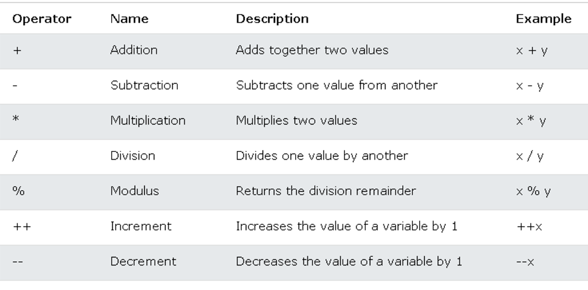
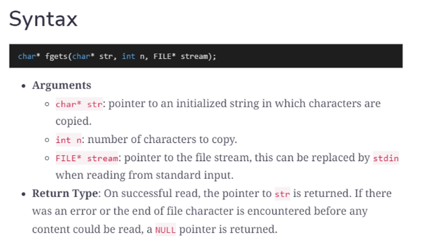

---
Install compiler
C is a compiled language
Need to compile before execution
---

# Basic print code

```c
#include <stdio.h>
// header file library that lets us work with input and output functions like printf
// Stands for Standard Input Output

int main()
{
    printf("HellOOOOOOOOOOOOOO");
    return 0;
    // return 0 if successful , return 1 if error
}
```

# Format specifier

Define type of variable to be displayed

```c
//Declare variable
float num = 4.25;

// print float
printf("Number is %f", num);
//Number is 4.250000

//print float 2decimal number
printf("Number is %2.f", num);
//Number is 4.25
```

```c
// %c = character
// %s = string
// %f = float
// %lf = double
// %d = integer

// %.1 = decimal
// %1 = minimum field width
// %- = left align
```

Float 6 - 7 digits
Double has double the digits 15 -16 digits

| Format Specifier       | Description                                                                                 |
| ---------------------- | ------------------------------------------------------------------------------------------- |
| `%d`                   | For integers (decimal)                                                                      |
| `%u`                   | For unsigned integers (decimal)                                                             |
| `%o`                   | For octal integers                                                                          |
| `%x`, `%X`             | For hexadecimal integers (lowercase or uppercase letters)                                   |
| `%f`                   | For floating-point numbers (decimal notation)                                               |
| `%e`, `%E`             | For floating-point numbers (scientific notation with lowercase or uppercase "E")            |
| `%g`, `%G`             | For floating-point numbers (use `%e` or `%f`, depending on which is more compact)           |
| `%c`                   | For characters                                                                              |
| `%s`                   | For strings                                                                                 |
| `%p`                   | For pointers (prints the memory address)                                                    |
| `%n`                   | For writing the number of characters written so far to an integer pointer argument          |
| `%i`                   | Same as `%d`, for integers                                                                  |
| `%a`, `%A`             | For hexadecimal floating-point numbers (lowercase or uppercase letters)                     |
| `%lu`                  | For long unsigned integers (decimal)                                                        |
| `%lld`, `%ld`, `%d`    | For long long integers, long integers, and regular integers respectively                    |
| `%lldu`, `%ldu`, `%du` | For unsigned long long integers, unsigned long integers, and unsigned integers respectively |
| `%Lf`                  | For long double floating-point numbers                                                      |
| `%%`                   | For printing the % symbol itself                                                            |

# **Type conversion**

## **Implicit conversion (automatic)**

Done automatically by the compiler when you assign a value of one type to another

```c
// Automatic conversion: int to float
float myFloat = 9;

printf("%f", myFloat); // 9.000000
```

## Explicit conversion (manual)

Done manually by placing the type in parentheses ( )

```c
// Manual conversion: int to float
float sum = (float) 5 / 2;

printf("%f", sum); // 2.500000
```

---

# Constants

Variable with fixed value that cannot be altered

```c
//Cannot change const
const int myNum = 15;
myNum = 10;

//Examples
const int minutesPerHour = 60;
const float PI = 3.14;

//Good naming convention for const
//is ALL UPPERCASE
int YEAR = 2023;
```

---

# Operators



## **Augmented** Assigned Operators

+=

-=

\*=

%=

---

# Conditional statements

```c
//if else
if (condition1) {

} else if (condition2) {

} else {

}
```

## While loop

```c
//for loop
for (int i = 0; i < 5; i++) {
  printf("%d\n", i);
}
```

```c
//while loop
while (condition) {
  // ...
}

//do while loop ( Excecute code once , then repeat if true )
do {
  // ...
}
while (condition);
```

## Ternary operators

```c
//Ternary operator
// *variable = (condition) ? expressionTrue : expressionFalse;*
int x = 3;
(x < 18) ? printf("Good day.") : printf("Good evening.");
```

## Switch case

```c
//switch case
switch(expression) {
  case x:
    // code block
    break;
  case y:
    // code block
    break;
  default:
    // code block
}
```

## break vs continue

```c
break; //breaks out of the loop

continue; //breaks out of the current iteration only
```

## Logical operators

```c
&& //and

|| //or

! //not
```

---

# Arrays

```c
int myNumbers[] = {25, 50, 75, 100};
//dont need to include size of array as there is a initializer list,
// C will infer the size from the initializer
// SAME AS        *int myNumbers[**4**] = {25, 50, 75, 100};*

//2D arrays / Matrix
int matrix[2][3] = {{1,2,3},{4,5,6}}
//2 Rows , 3 Col
```

---

# Strings

In C programming, there is no `string` variable type. Instead, strings are represented as arrays of characters. Here's an example of how to declare and print a string in C:

```c
char myString[] = "Hello, world!";
printf("%s", myString);

```

Note that the string must be enclosed in double quotes and that the array must be big enough to hold the string, including the null terminator (`\\0`) at the end.

## String Functions

- Functions
  C provides several built-in functions for working with strings. Here are a few examples:

  ### `strlen()`

  Returns the length of a string (excluding the null terminator).

  ```c
  char myString[] = "Hello, world!";
  int length = strlen(myString);
  printf("%d", length); // Output: 13

  ```

  ### `strcpy()` and `strncpy()`

  Copies one string to another. `strcpy()` copies the entire string, while `strncpy()` lets you specify the maximum number of characters to copy.

  ```c
  char myString[] = "Hello, world!";
  char copy[20];

  // Copy entire string
  strcpy(copy, myString);
  printf("%s", copy); // Output: Hello, world!

  // Copy first 5 characters
  strncpy(copy, myString, 5);
  printf("%s", copy); // Output: Hello

  ```

  ### `strcat()` and `strncat()`

  Concatenates one string onto the end of another. `strcat()` concatenates the entire string, while `strncat()` lets you specify the maximum number of characters to concatenate.

  ```c
  char myString[] = "Hello, ";
  char name[] = "John";

  // Concatenate entire string
  strcat(myString, name);
  printf("%s", myString); // Output: Hello, John

  // Concatenate first 2 characters
  strncat(myString, name, 2);
  printf("%s", myString); // Output: Hello, JohnJo

  ```

  ### `strcmp()`

  Compares two strings and returns an integer indicating their relationship. Returns 0 if the strings are equal, a negative number if the first string is less than the second, and a positive number if the first string is greater than the second.

  ```c
  char string1[] = "apple";
  char string2[] = "banana";
  int result = strcmp(string1, string2);
  printf("%d", result); // Output: -1

  ```

### Single quote vs double quote

In C and C++ the single quote is used to identify the single character, and double quotes are used for string literals.

## <string.h>

Include header for string functions

## NULL Character , \0

> Used to indicate the end of a string

```c
char myStringOne[6] = {'h', 'e', 'l', 'l', 'o', '\0'};
// Add null char for char array to end string

char myStringTwo[] = "hello";
// STRING LITERAL
// C automatically adds the null character to the end of the string.
```

## Array of Strings

```c
char names[][10] = {"aloy","kar","tom"};
//same as matrix of characters
//meaning string array of max 10 items
```

# Scanner (Input)

```c
char name[25];

scanf("%s", &name);
//Store the input at address of 'name'
//& gets the *address of*

printf("Your name is %s", name);
```

## fgets

Read input from one line



```c
//fgets(variable to read to, input size, from where?)

char name[25];

fgets(name,25,stdin);

printf("Your name is %s", name);
```

# <math.h>

Math header file

```c
#include <math.h>

sqrt(9) //3
pow(2,4) //16
round(3.14) //3
ceil(3.14) //4
floor(3.99) //3
fabs(-2) //2
```

---

# Functions

```c
//Basic Function
void sayHi(){
	printf("HI!");
}

//Function with parameter with return type of int
int add(int num1,int num2){
	int res = num1 + num2;
	return res;
}
```

## Function prototype

- Declare function without body
- Give information to compiler about function
- _Ensure that call to function is made with correct parameters_

```c
//Declare first without body
double sum(double num1 ,double num2);

int main(){

	return 0;
}

double sum(double num1 ,double num2){
	//....
}
```

# Structs

Similar to classes , BUT no methods

```c
struct Student
{
    char name[20];
    int score;
};

int main()
{
    struct Student student1;
    struct Student student2;

    strcpy(student1.name, "Aloy");
    student1.score = 25;
    strcpy(student2.name, "Kar");
    student2.score = 100;

		//Struct array
		struct Student list[] = {student1, student2, student3, student4};

    return 0;
}
```

# Typedef

In C, `typedef` is used to create an alias for an existing data type. This can be useful for creating shorter or more descriptive names for types, or for creating more abstract types that can be changed more easily in the future.

For example, you could define a new name for the `int` data type:

```
typedef int myInt;

```

Now, you can use `myInt` instead of `int`:

```
myInt x = 5;

```

You can also use `typedef` to create a new name for a struct:

```
typedef struct {
    char name[20];
    int score;
} Student;

```

Now, you can create a new `Student` struct like this:

```
Student student1;

```

This can make your code more readable and easier to understand, especially when dealing with complex data structures.

# Enums

(Enumerations)

User defined values which consist of constant integers

- Makes the program easier to read

```c
enum enum_name {
   constant1, // default value = 0
   constant2, // 1
   constant3, // 2
   ...
};
```

```c
enum enum_name {
   constant1 = 20,
   constant2 = 3,
	 constant3, // value = prev+1 = 3+1 = 4
   constant4 = 11
   ...
};
```

---

# Pseudo Random number

```c
#include <stdio.h>
#include <stdlib.h>
#include <time.h>

int main()
{

    // generate pseudo random number based on time
    srand(time(NULL));

    for (int i = 0; i < 10; i++)
    {
        int n = rand();
        printf("%d ", n);
    }

    return 0;
}
```

---

# Bitwise Operators

```c
&	//AND
|	//OR
^	//XOR
~	//complement

<< //Shift left , same as times 2
>> //Shift right , same as divide by 2

```

---

# Memory address

```c
int num = 42;
printf("The memory address of num is %p\n", &num);
//Prints the memory address of the variable on the RAM
```
