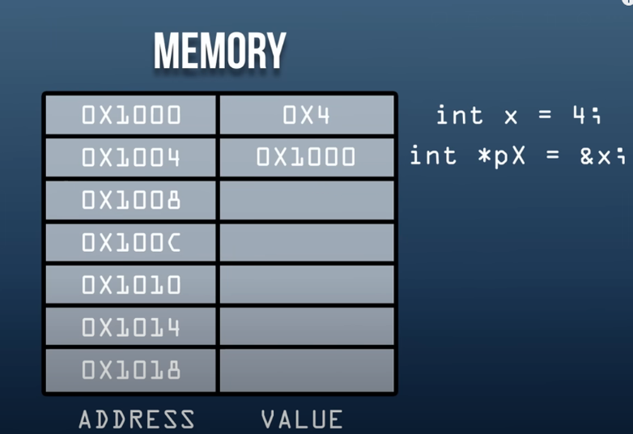
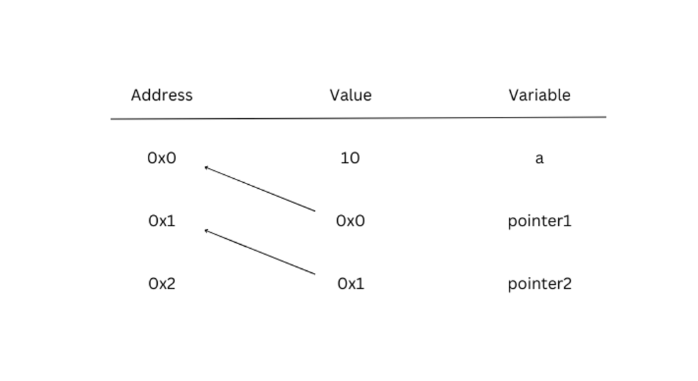
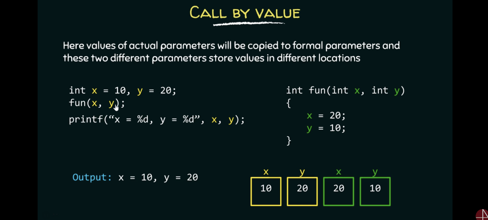
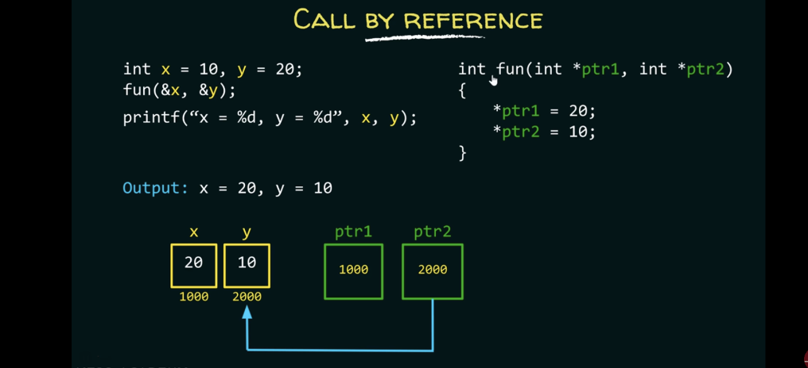

# Pointers & Memory in C/C++

Initialize pointer with **\***

Think of **&** as ‘the address of’

- is used to get the value from pointer (deferencing)

```c
int x= 3;

int *pX = &x;
// *integer pointer named pX is set to the address of x*

int y = *pX;
// * is used alone ( no type beside it )
// * is now a dereference , so it goes to the pointer address and gets the value
// *integer named y is set to the thing pointed to by pX*

```

Pointer is just a address


How I visualize pointers


Declaration: To declare a pointer variable, use the asterisk (\*) symbol before the variable name. For example:

```c
int *ptr; // declare a pointer to an integer variable
```

Assignment: To assign a memory address to a pointer variable, use the address-of operator (&) with the variable whose address you want to store. For example:

```c
int num = 5;
int *ptr = &num; // assign the address of num to ptr
```

Dereferencing: To access the value of the variable pointed to by a pointer, use the asterisk (\*) symbol before the pointer variable name. For example:

```c
int num = 5;
int *ptr = &num;
printf("%d", *ptr); // dereference ptr to get the value of num
```

Pointer Arithmetic: You can perform arithmetic operations on pointers such as addition, subtraction, etc. For example:

```c
int arr[] = {1, 2, 3, 4};
int *ptr = &arr[0];
ptr++; // points to arr[1]
```

Null Pointer: A null pointer is a pointer that does not point to any memory location. To initialize a pointer as a null pointer, use the constant value "NULL" or "0". For example:

```c
int *ptr = NULL; // initialize ptr as a null pointer
```

Pointer to Pointer: A pointer to a pointer is a pointer variable that holds the address of another pointer variable. For example:

```c
int num = 5;
int *ptr = &num;
int **pptr = &ptr; // pointer to pointer
```

Passing Pointers to Functions: Pointers can be passed to functions as arguments. When a pointer is passed to a function, the function can modify the value of the pointed-to variable. For example:

```c
void change_num(int *ptr) {
    *ptr = 10;
}

int main() {
    int num = 5;
    int *ptr = &num;
    change_num(ptr); // changes the value of num to 10
    return 0;
}
```

# Advantages of using pointers in C:

1. Dynamic memory allocation
2. Accessing array elements
3. Passing parameters to functions
4. Returning multiple values from functions
5. Implementing complex data structures
6. Interacting with hardware

---

# Call by value

- Variable passed into arguement is copied
- Function does not affect the original variable



# Call by reference

- Address to variable is passed into arguement
- Function affect original variable




# Pointer to array

```c
char c1[] = "Hello";
char *c2;
c2 = c1;
//c2 is now a pointer that points to the first char of the c1 array
// = points to address of char 'H'
```

---

# Pointer to function

```c
*return_type (*pointer_name)(arguments); //syntax*

int add(int a, int b) {
    return a + b;
}

int (*ptr)(int, int) = &add; //create function pointer and point to addFunction
int result = (*ptr)(2, 3); // calling the function using the pointer by dereferencing it
```

## Callbacks

> Callback is a function passed as an arguement into another function
> which can be executed later

**_callbacks can make code more modular, flexible, and maintainable._**

---

# Application memory

> Portion of memory used by application

## Categories

- Code
- Data
- Stack
- Heap

[The Call Stack](https://www.youtube.com/watch?v=Q2sFmqvpBe0)

# Stack

- Limited size
- Variables declared within a function, function arguments, and return addresses are stored in stack
- Too much spaced used in stack results in **stack overflow**
- Implements stack data structure

# Heap

- Size can increase dynamically
- Memory that is manually allocated and managed by the programmer
- UNRELATED to heap data structure

---

# Dynamic memory allocation

In C , we use these functions to dynamically allocate memory in the heap

## malloc()

```c
*void* malloc(size_t size); //syntax*

int* ptr = (int*) malloc(10 * sizeof(int));// i don't think need to type cast
```

Allocate memory of a certain size , each byte is not initialized

## calloc()

```c
*void* calloc(size_t num, size_t size); //syntax*

int* ptr = (int*) calloc(10, sizeof(int));
```

Allocate memory of a certain size , initialize the block of memory to 0

## realloc()

```c
*void* realloc(void* ptr, size_t size); //syntax*

int* ptr = (int*) malloc(10 * sizeof(int)); //hold 10 int
ptr = (int*) realloc(ptr, 20 * sizeof(int)); //reallocate to hold 20 int
```

Allocate memory of a certain size , initialize the block of memory to 0

## free()

Memory allocated on the heap using **`malloc`**, **`calloc`**, or **`realloc`**remains allocated until it is explicitly freed using the **`free()`**function.

## Using pointers in the stack causing errors

This happens when the memory location the pointer is pointing to has been deallocated.

Might happen when the memory location has been overwritten

Solution:

**Use pointers in the heap!**

**→** Data has to be explicitly deallocated, so no overwritting of data

---

# Memory Leak

> Happens when memory in the heap is not deallocated after use

→ can cause program to crash

To Avoid : Manage memory allocation and deallocation

eg. using **free( )** in C to deallocate memory after it is used
