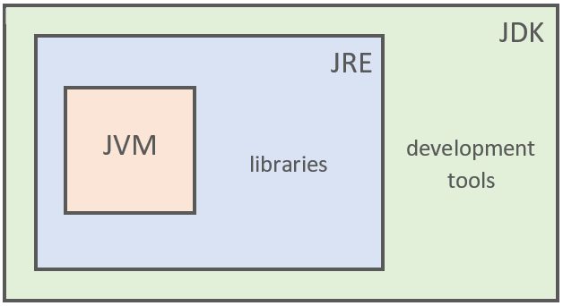
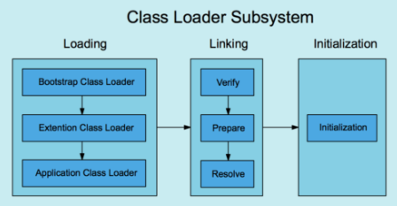
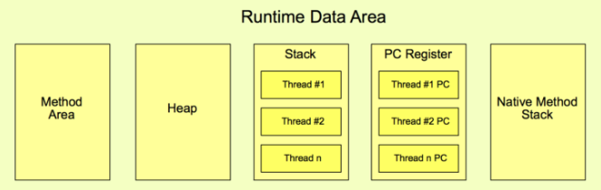
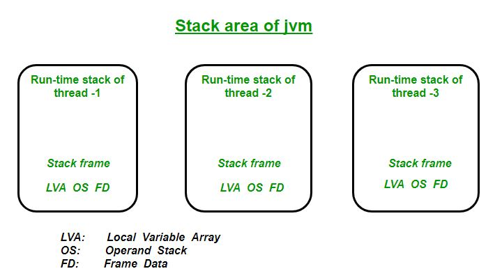
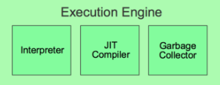
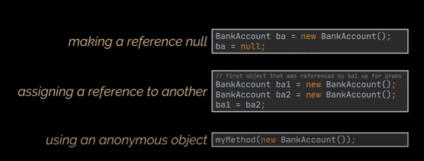

# JDK , JRE , JVM



# JDK (Java Development Kit)

JDK = Developer tools + JRE

> JDK is only used by Java Developers.

## What does JDK do?

- Convert java source code (.java files) to bytecode(.class files) that can be executed on JVM later
- Use JAR tool to bundle multiple class files into a single JAR file for better distribution

# JRE (Java Runtime Environment)

JRE provides environment to only run (not develop) the java program onto your machine

> JRE is only used by users who want to run the Java Programs

JRE = Class Libraries (from Java API) + JVM

# JVM (Java Virtual Machine)

JVM Architecture


3 main components of the JVM:

- Class Loader
- Runtime Data Area
- Execution Engine

<sup> + extra components like Java Native Interface (JNI) and Native Method Libraries</sup>

## Class Loader Subsystem



Components of the class loader:

> Loading : Load classes from .class file into memory (Runtime Data Area)

- Bootstrap class loader : load core Java classes and libraries eg. java.lang / java.util
- Extension class loader : load optional extensions eg.JDBC drivers
- Application class loader : load classes I have written for java application

After class is loaded into memory , linking process starts ...

> Linking

- Verify : checks the structural correctness of bytecode of the loaded .class file, else throw `VerifyError`
- Prepare : Allocates memory for the static fields of a class or interface, and initializes them with default values.

  - eg. you have this code in your class

  ```java
  // Your code
  private static final boolean enabled = true;
  ```

  - the JVM will allocate memory for the variable `enabled` and set it to default value of boolean which is `false` as this is before initialization

  ```java
  // What really happens in during 'Prepare'
  private static final boolean enabled = false;
  ```

- Resolution : All symbolic memory references are replaced with the original references
  ```java
  public class MyClass {
      public void myMethod() {
          SomeOtherClass.someMethod();
          }
      }
  ```
  - eg. the JVM resolves where SomeOtherClass is located, verifies the existence of someMethod, and establishes the necessary connections between MyClass and SomeOtherClass

> Initialization : Static variables are assigned original values and static blocks are executed.

```java
// A static variable
    static int myStaticVar;

// A static initialization block , executed once when the class is loaded into memory
    static {
        System.out.println("Static initialization block is executed.");
        myStaticVar = 42;
    }
```

## Runtime Data Access



Components of the class loader:

### Method Area

> Stores all the class level data such as:

- the run-time constant pool (a place to store variables in methods)
- field
- method signatures
- code for methods and constructors

eg.

```java
//Both added to method area
public class Employee {

// Field level data
  private String name;
  private int age;

// Constructor details
  public Employee(String name, int age) {
    this.name = name;
    this.age = age;
  }
}
```

### Heap Area

> Stores objects (objects are created with `'new'` keyword)

```java
// Stored in the heap
Employee employee = new Employee();
```

_Note : There is typically one shared Method Area and one shared Heap for all threads running within the JVM._

### Stack Area

> The stack is a region of memory used for the execution of a program, particularly for managing function calls and local variables

> Last In First Out (LIFO) data structure , push methods in to call stack and pop methods when completed



Every thread creates a new stack area = thread safe

#### Stack Frame

> Each time a function is called, a new stack frame is created and pushed onto the call stack , after the function is finished it is popped out of the call stack

Parts of the stack frame :

- Local Variable Array: This is where the method's local variables are stored. These variables have method-level scope and are used for temporary data storage during the method's execution.

- Operand Stack: It serves as an internal call stack within the method and is used to perform various operations, such as arithmetic calculations and holding intermediate results.

- Frame Data: This part of the stack frame contains important information for managing the method's execution, including exception handling, the return address, method parameters, and potentially other contextual data required for proper execution.

### Program Counter (PC) Register

> Program Counter (PC) Register is to point to the memory address of the next instruction to be executed in a computer program.

> Each thread has its own Program Counter (PC) Register

### Native Method Stack

> Native Method Stack is a memory stack (method call stack) specifically designed to handle the execution of native methods that are called through the Java Native Interface (JNI).

> Each thread has its own separate native method stack

## Execution Engine



> The bytecode which is assigned to the Runtime Data Area will be executed by the Execution Engine. It reads the bytecode and executes it piece by piece.

### Interpreter

> The interpreter of the execution engine reads and executes bytecode instructions one at a time , but slower than JIT because of line by line execution and re-inteprets repeated code

### Just-In-Time (JIT) compiler

> JIT compiler translates Java bytecode into optimized native machine code during program execution, improving performance.

- The Execution Engine first uses the interpreter to execute the byte code, but when it finds some repeated code, it uses the JIT compiler.

The JIT Compiler has the following components:

- Intermediate Code Generator - generates intermediate code from Java bytecode
- Code Optimizer - optimizes the intermediate code for better performance
- Target Code Generator - converts intermediate code to native machine code
- Profiler - finds the hotspots (code that is executed repeatedly)

### Garbage Collector

> Garbage Collector is responsible for destroying objects no longer used to free space in the heap and prevent memory leaks

> In Java, GC is done automatically

Objects are either:

- alive (used and referenced)
- dead (no longer used / referenced , detected by GC and deleted to free memory)
  

Phases of Garbage collection:

1. Mark - in this step, the GC identifies the unused objects in memory

2. Sweep - in this step, the GC removes the objects identified during the previous phase

There are different GC algorithms such as :

- Serial GC (single thread for small apps)
- Parallel GC (multi-threaded)
- Garbage First (G1) GC (multi-threaded applications that have a large heap size available)

## Java Native Interface (JNI)

> JNI allows Java code to interact with and call native code written in languages like C and C++.

- Use the `native` keyword to indicate that the method implementation will be provided by a native library
- Also need to invoke System.loadLibrary()

## Native Method Libraries

> Methods written using JNI are implemented in native code and compiled into a Native Method Library. The Java application can then use these native methods by loading the corresponding Native Method Library, allowing it to call and interact with the native code
