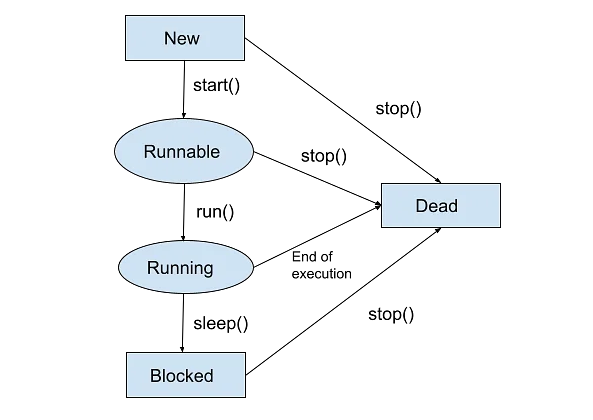

> A thread is a lightweight, independent, and concurrent unit of execution within a program

Threads allow multiple tasks to be performed concurrently, and each stack has its own call stack & program counter

# Ways to create a thread

1.  extends `Thread`

```java
public class ThreadExtend extends Thread {

    public void run(){
        for (int i = 0; i<3 ; i++) {
            System.out.println("This is the class that extends Thread");

            try {
                Thread.sleep(1000);
            } catch (InterruptedException e) {
                throw new RuntimeException(e);
            }
        }
    }

}
```

2. implements `Runnable`

```java
public class ThreadImplementRunnable implements Runnable{

    @Override
    public void run() {
        for (int i = 0; i<3 ; i++) {
            System.out.println("This is the class that implements Runnable interface!");
            try {
                Thread.sleep(1000);
            } catch (InterruptedException e) {
                throw new RuntimeException(e);
            }
        }
    }
}
```

Both have similar implementations , but to use them ...

```java
public class Main {
    public static void main(String[] args) throws InterruptedException {

        // Used when you want to create a specialized type of thread
        ThreadExtend threadExtend = new ThreadExtend();

        threadExtend.start();

        //  Use `implements Runnable` you are defining a task ThreadImplementRunnable() that can be executed by a thread
        ThreadImplementRunnable threadImplementRunnable = new ThreadImplementRunnable();
        Thread thread = new Thread(threadImplementRunnable);

        thread.start();
    }
}
```

## When to use which implementation

`extends Thread`

> Creates the functionality directly in a thread

Use this when you want to create a new type of thread with customized behavior

`implements Runnable`

> Creates a functionality which can be used in the constructor of a thread

Use this when you want to define a task that can be executed by multiple threads without creating new thread types.

# Thread Lifecycle



# Daemon Threads

> Daemon threads are low-priority threads that run in the background, providing services to non-daemon (user) threads.

The key distinction is that the JVM doesn't wait for daemon threads to finish before it exits. If all non-daemon (user) threads have completed, the JVM will exit, even if daemon threads are still running.
