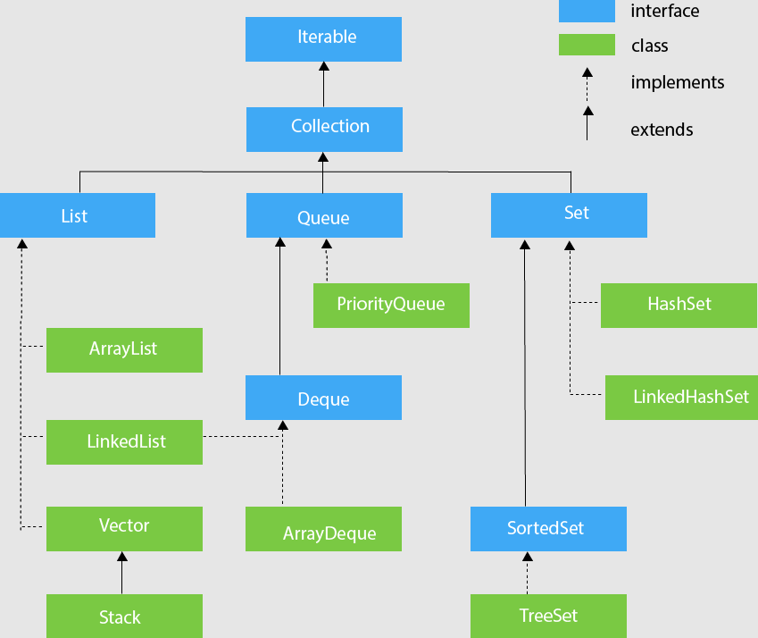

Java Collection Framework provides a set of data structures and interfaces that developers can use to manage and manipulate collections of objects.

- ArrayList
- LinkedList
- Vector
- Stack
- HashSet
- LinkedHashSet
- TreeSet
- HashMap
- LinkedHashMap
- TreeMap
- Hashtable
- Queue (interface)
- PriorityQueue
- ArrayDeque

# Common methods for classes in Collection framework

Common methods in Collection Interface include :

- add
- remove
- contains
- isEmpty
- size
- iterator

## Iterator class

```java
List<String> names = new ArrayList<>();
names.add("Alice");
names.add("Bob");
names.add("Charlie");

// Has a pointer to an element of the collection it is iterating over
Iterator<String> iterator = names.iterator();

while (iterator.hasNext()) {
    String name = iterator.next();
    System.out.println(name);

    // You can remove elements if needed with iterator.remove();
}
```
