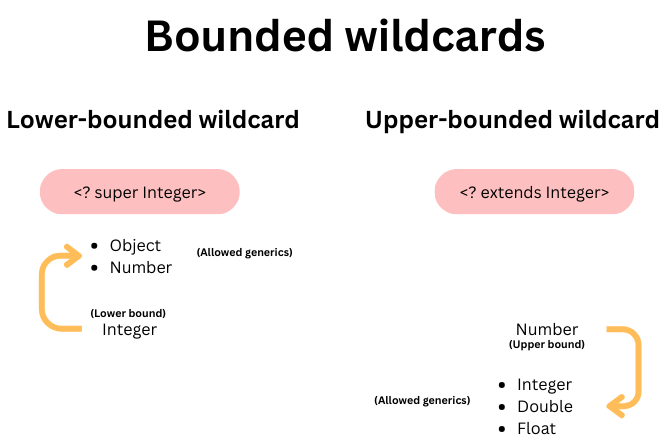

# Generics

> Generics in Java provide a way to create classes, methods, and interfaces that can work with different data types

Mostly used for :

- class / interface definition
- method signature
- variables
- collections

Here we create a generic container which can store value of any data type

```java
public class GenericContainer<T> {
    private T value;

    public GenericContainer(T value) {
        this.value = value;
    }

    public T getValue() {
        return value;
    }

    public static void main(String[] args) {
        // Create a GenericContainer for an Integer
        GenericContainer<Integer> intContainer = new GenericContainer<>(42);
        int intValue = intContainer.getValue();
        System.out.println("Integer Value: " + intValue);

        // Create a GenericContainer for a String
        GenericContainer<String> strContainer = new GenericContainer<>("Hello, Generics!");
        String strValue = strContainer.getValue();
        System.out.println("String Value: " + strValue);
    }
}

```

## Popular generic type parameter naming convention

| Type Parameter |                                         When to use?                                          |
| :------------: | :-------------------------------------------------------------------------------------------: |
|       T        |             Stands for "Type" and is a widely used identifier for a generic type.             |
|       E        |         Typically used for elements in collections (e.g., elements in a List or Set).         |
|      K,V       |      Commonly used for key and value types in key-value pair data structures like maps.       |
|       N        |    Often used to represent a number (e.g., Number in mathematics or numerical operations).    |
|     S,U,V      | Generic type parameters used when you have more than one type parameter in a class or method. |

# Wildcard

Only used for :

- collections (because they are designed to store multiple elements of various types)

## Unbounded wildcard

```java
public static void printList(List<?> list) {
  for (Object item : list) {
      System.out.print(item + " ");
  }
  System.out.println();
}

public static void main(String[] args) {
  List<Integer> integerList = List.of(1, 2, 3);
  List<String> stringList = List.of("Hello", "World");
}
```

## Upper-bounded wildcard

Upper bounded means the wildcard ? which extends Numbers can only be a subtype of Numbers for eg. Numbers / Integer / Double

---

upper bounded by Number (is a subType , extends Number) , examples:

- Number (itself)
- Integer
- Double
- Float

> public void method(List <? extends Number> list){ ... }

---

```java
public static double sumOfList(List<? extends Number> numbers){
  double sum = 0;
  for (Number num : numbers){
    sum += num;
  }
  return sum;
}
public static void main(String[] args) {
  List<Integer> integers = Arrays.asList(1, 2, 3);
  List<Double> doubles = Arrays.asList(2.5, 4.8, 6.2);
}
```

## Lower-bounded wildcard

Lower bounded means the wildcard ? which is a super to Integer can only be a supertype of Integer for eg. Integer / Object / Number

---

lower bounded by Integer (is a superType, super Integer) , examples (Integer's parents):

- Object
- Number
- Integer (itself)

> public void method(List <? super Integer> list){ ... }

---

```java
public static void addNumbers(List<? super Integer> list) {
  // This method accepts a list of any type that is a supertype of Integer.

  list.add(1);
  list.add(2);
  list.add(3);
}

public static void main(String[] args) {
  List<Object> objectList = new ArrayList<>();
  List<Number> numberList = new ArrayList<>();
  List<Integer> integerList = new ArrayList<>();

  addNumbers(objectList);
  addNumbers(numberList);
  addNumbers(integerList);

  System.out.println("Objects: " + objectList);
  System.out.println("Numbers: " + numberList);
  System.out.println("Integers: " + integerList);
}
```

## Bounded wildcards illustration



# When to use generic or wildcards?

- Use generics if you do not care about the type

- Use wildcards you do care about the type
  (i.e. you need to perform an operation that only the T type has then you need to specify the restriction on the type [e.g. `<T extends String>`])
