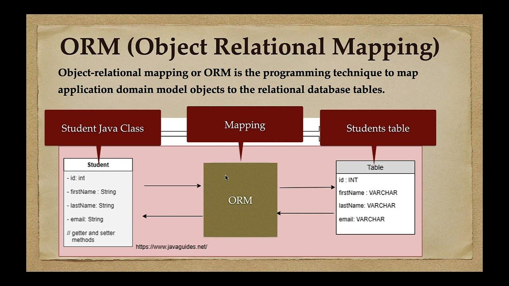
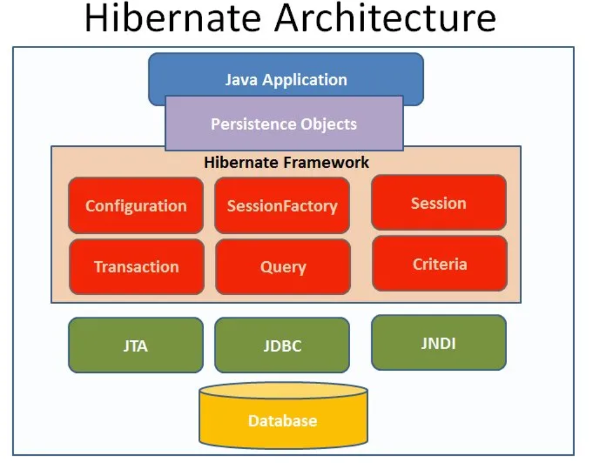
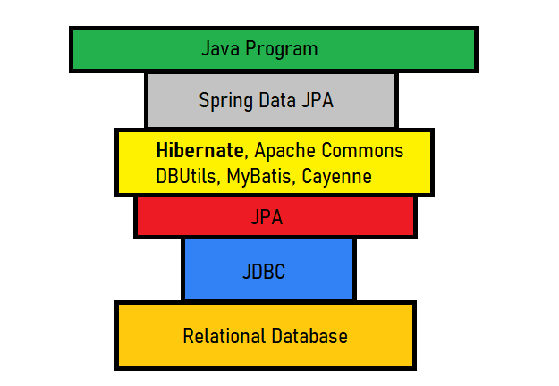
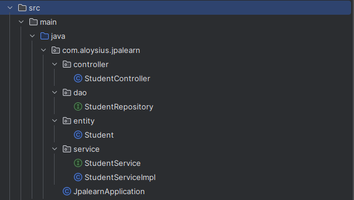

# What is Object-Relational Mapping (ORM)?



Basically...

- Save to database : Object -> ORM -> Database

- Extract from database : Database -> ORM -> Object

# What is Java Persistence API (JPA)?

> JPA is a Java specification for managing relational data in an object-oriented way, enabling the mapping of Java objects to database tables and simplifying database interactions.

It is not an implementation, but a specification that various ORM frameworks, like Hibernate, EclipseLink, and Apache OpenJPA, implement.

# What is Hibernate?



> Hibernate is an ORM framework that facilitates the mapping of Java objects to database tables and simplifies database interactions in Java applications.

It is an implementation framework that follows the JPA specification ( one of the JPA providers )

# What is Spring Data JPA?



> Spring Data JPA is a framework that builds on top of JPA (including Hibernate as a potential JPA provider) to make it even easier to work with databases in Spring applications (extra layer of abstraction)

It is not an implementation or JPA provider, it's just an abstraction used to significantly reduce the amount of boilerplate code required to implement data access layers for various persistence stores.

# Using Spring Data JPA in Spring Boot



File Structure for Spring Boot application:

- **StudentController**: Concrete class that manages endpoints for frontend / REST API calls

  ```java
  @RestController
  @RequestMapping("/students")
  public class StudentController {
      @Autowired
      private StudentService studentService;

      @GetMapping
      public List<Student> findAllStudent() {
          return studentService.findAllStudent();
      }

      // etc...
      // Ommited other methods for brevity

  }
  ```

- **StudentRepository**: Fulfils the role of repository (other classes can use it to manipulate database)

  ```java
    // DAO (Data access object) layer

    // @Repository tells Spring that this class is a repository
    // JpaRepository contains API for basic CRUD operations and more..
    @Repository
    public interface StudentRepository extends JpaRepository<Student,Long> {

    }

  ```

- **Student**: POJO Student entity that is used to map to database

  ```java
  // @Entity annotation defines that a class can be mapped to a table
  @Entity
  public class Student {

      public Student(String firstName, String lastName, String email) {
          this.firstName = firstName;
          this.lastName = lastName;
          this.email = email;
      }

      // @ID annotation specifies the primary key of the entity.
      // @GeneratedValue annotation specifies the primary key generation strategy to use
      @Id
      @GeneratedValue(strategy = GenerationType.IDENTITY)
      private int id;

      @Column(name = "first_name") // @Column annotation specifies which column in database
      private String firstName;

      @Column(name = "last_name")
      private String lastName;

      private String email;

      // Getters and setters ommited for brevity
  }
  ```

- **StudentService**: Interface for **StudentServiceImpl**

- **StudentServiceImpl**: Service class defines methods that interact with the repository and are invoked by the controller.

  ```java
  @Service
  public class StudentServiceImpl implements StudentService{

      @Autowired
      StudentRepository studentRepository;
      @Override
      public List<Student> findAllStudent() {
          return studentRepository.findAll();
      }

      // etc...
      // Ommited other methods for brevity

  }
  ```

As you can see we can easily use Spring Data JPA in Spring / Spring Boot applications by just :

- creating a entity POJO class
- a repository interface class which extends the JpaRepository interface which enables the repository to use its database CRUD methods.
