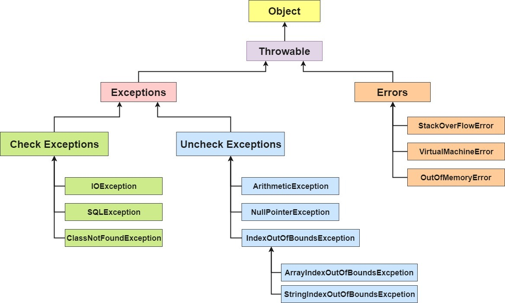

All exceptions in Java are derived from the Throwable class, which has two main subclasses:

- Error : severe and typically unrecoverable errors (e.g. OutOfMemoryError)
- Exception : exceptions that are recoverable and can be caught and handled.

# Error vs Exception

| Error                                | Exception                       |
| ------------------------------------ | ------------------------------- |
| Unchecked exception                  | Checked & Unchecked exception   |
| Caused by environment of application | Caused by application           |
| During run-time                      | During compile time or run-time |

# Checked vs Unchecked exception

## Checked exception

> aka. compile time exception

must be either caught (try-catch) or declared in the method signature using the throws keyword.

## Unchecked exception

> aka. run time exception

Do not need to be explicitly caught or declared. They typically indicate programming error that should be addressed

# Java Exception Hierarchy



# Handling Exceptions

Note , can use generic "Exception" class since all exceptions extend from it or use a specific exception

## try , catch , finally

```java
try {
    // Code that may throw exceptions
} catch (ExceptionType1 e1) {
    // Handle ExceptionType1 , can log out the exception
} catch (ExceptionType2 e2) {
    // Handle ExceptionType2
} finally {
    // Optional: Code that always runs, regardless of whether an exception occurred (can use for cleanup)
}


//Multiple exception shorthand
try {
    // Code that may throw exceptions
} catch (NullPointerException | NumberFormatException e) {
    // Handle both NullPointerException and NumberFormatException here
}

```

## throw

Explicitly throw an exception

```java
if (errorCondition) {
    throw new CustomException("This is a custom exception message");
}
```

## throws

```java
public void someMethod() throws IOException {
    // Method code that may throw an IOException
}
```

# Custom Exception

Can add custom functionalities for custom exception

```java
public class CustomException extends Exception {
    private int errorCode; // Additional error code
    private String errorDetails; // Additional error details

    public CustomException(String message) {
        super(message);
    }

    public CustomException(String message, int errorCode, String errorDetails) {
        super(message);
        this.errorCode = errorCode;
        this.errorDetails = errorDetails;
    }
}
```
