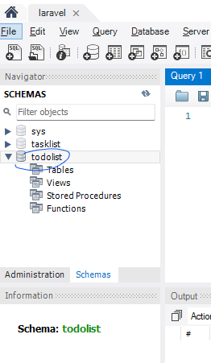
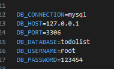
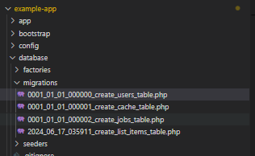
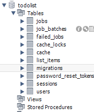

1. Install PHP using XAMPP
2. Install COMPOSE (PHP dependecy manager)
3. Run below to create a laravel app named example-app

```php
composer create-project laravel/laravel example-app
```

4.

```php
cd example-app
```

# Connect to DB

```php
// Can now run laravel web app using
php artisan serve
```

To connect to mySQL database:
I use mySQL workbench
Connect a connection
Create a database eg.



Add database details to .env file



# Create model migration

```php
php artisan make:model ListItem -m

// This creates a ListItem model (/app/Models)

// and a migration file (/database/migrations) where I can configure the table columns which will be created
```

```php
php artisan migrate

//Migrate meaning create tables in connected database
```

Now my database looks like this , because there are multiple default tables




