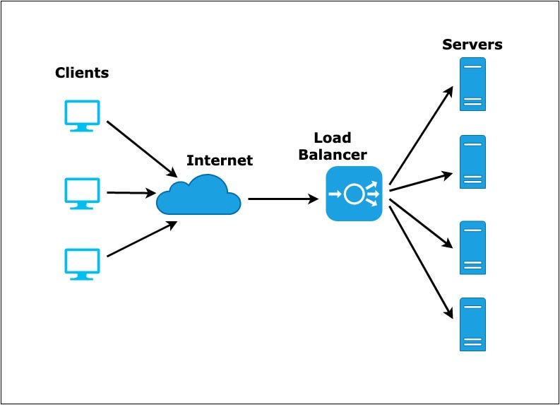

# Vertical scaling

> Increasing the resources of a single server/machine to handle a higher workload
> aka. **scaling up**

Disadvantage :

- resource ($$$)
- practical limit on how much server can scaled

# Horizontal scaling

> Add more servers/machine to handle increased workload
> aka. **scaling out**

**Shared session state** refers to maintaining consistent user session data across multiple instances of a distributed application or system.

**RAID (Redundant Array of Independent Disks)** is a technology that combines multiple physical hard drives into a single logical unit to improve performance, fault tolerance, and storage capacity in data storage systems.

**Session caching** stores user session data in a shared cache for improved performance and scalability in distributed systems.

# Load balancing

> Load balancing refers to the process of distributing incoming network traffic or computing tasks across multiple servers, resources, or computing nodes
> to ensure efficient utilization of those resources and to prevent overload on any individual server.

# Caching

> Caching refers to the practice of storing frequently accessed or computationally expensive data in a temporary storage location called a cache

# Database replication

> **Data Replication:**
> Copying and synchronizing data across multiple locations for redundancy, availability, and fault tolerance.

# Redundancy

> Practice of having backup or duplicate components, systems, or resources that are ready to take over in the event of a failure.

**Active : Passive :** One system handles traffic while another remains on standby for failover, used for availability and minimizing downtime. (passive takes over active when active is down)

**Active : Active :** Multiple systems share incoming workloads actively, used to maximize resource utilization and scalability while maintaining availability.

# Database partitioning
