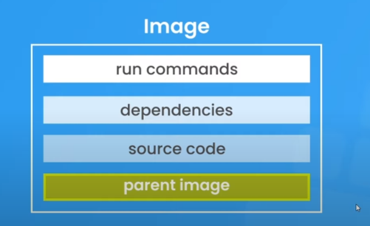

Docker containerizes code for consistent and reproducible execution across different machines.

> Image = blueprint for container



Image contains:

- runtime environment
- application code
- dependencies
- extra config (e.g. env variables)
- commands

> Container = runnable instance of an image , runs the application

# How to use docker

1. Create `Dockerfile` which is a script that contains a set of instructions for building a Docker image

DockerFile :

```bash
# Use the official Node.js 14 image as the base image
FROM node:14

# Set the working directory inside the container to /app
WORKDIR /app

# Copy the contents of the current directory (where the Dockerfile is) into /app in the container
COPY . .

# Run npm install to install the dependencies based on the package.json file
RUN npm install

# maps port 3000 on localhost to port 3000 which is exposed on docker container
EXPOSE 3000

# Specify the default command to run when the container starts
CMD [ "node", "app.js" ]
```

Create `.dockerignore` file so that docker ignores files such as `node_modules`

2. Run `docker build .` to build a docker image

3. Run `docker run -p 3000:3000 58ee4942eb1a` creates a container from the docker image (58ee4942eb1a) and runs it on port 3000

4. See list of running containers `docker ps`

5. To stop docker container(eg. c1) `docker stop c1`

6. See list of existing containers `docker ps -a`

7. To start a existing docker container `docker start c1`

## Layer Caching in Docker

When you build an image, Docker caches each layer so that if a layer hasn't changed, it doesn't need to be rebuilt, saving time and resources.

**Before layer caching:**

```Dockerfile
FROM node
WORKDIR /app
COPY . .          # Copy over all files in the current directory
RUN npm install   # Install dependencies
RUN npm build     # Run build
```

**After layer caching:**

```Dockerfile
FROM node
WORKDIR /app

# Copy only the package files
COPY package*.json ./
RUN npm install

# Copy the rest of the application code
COPY . .
RUN npm build
```

If there are no changes in dependencies, and only changes in source files, a significant amount of time will be saved during the image-building process as the dependencies are not reinstalled from `npm install` since they are cached.

## Docker Image with Tag

Docker image tags are used to create different versions of an image. Tags help identify and manage specific versions of your application within Docker.

```bash
# Builds a Docker image named 'myapp' with tag 'v1'
docker build -t myapp:v1 .
```

```bash
# Runs a Docker container using the 'myapp' image with tag 'v1'
docker run -d -p 4000:4000 myapp:v1
```

These commands demonstrate how to build a Docker image with a specific tag (`v1`) and then run a container using that tagged image. The tag serves as a version identifier, allowing you to manage different releases or variations of your application.

## Docker volumes

Docker volumes allow you to persist and share data between containers and the host machine. The -v flag in the docker run command is used to create and manage volumes.

```bash
# the -v flag will mount the local directory D:\src\docker-crash-course\api to the /app/ directory inside the container
docker run -v D:\src\docker-crash-course\api:/app/ my_image
```

Changes made in that local directory on the host machine are reflected immediately inside the container

## Docker Compose

Docker Compose is a tool for defining and running multi-container Docker applications. It allows you to define all services, networks, and volumes in a single YAML file (docker-compose.yml) for easy orchestration.

```yaml
version: "3.8"
services:
  api:
    build: ./api
    container_name: api_c
    ports:
      - "4000:4000"
    volumes:
      - ./api:/app
      - /app/node_modules
```

```bash
# Run services
docker-compose up
# build and run services
docker-compose up --build

# Stop services
docker-compose down
```
