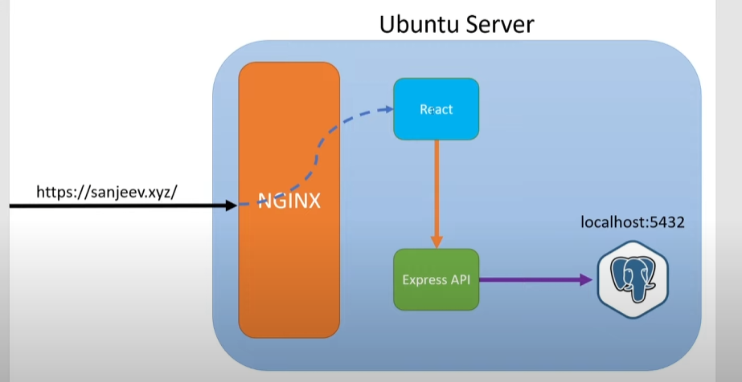
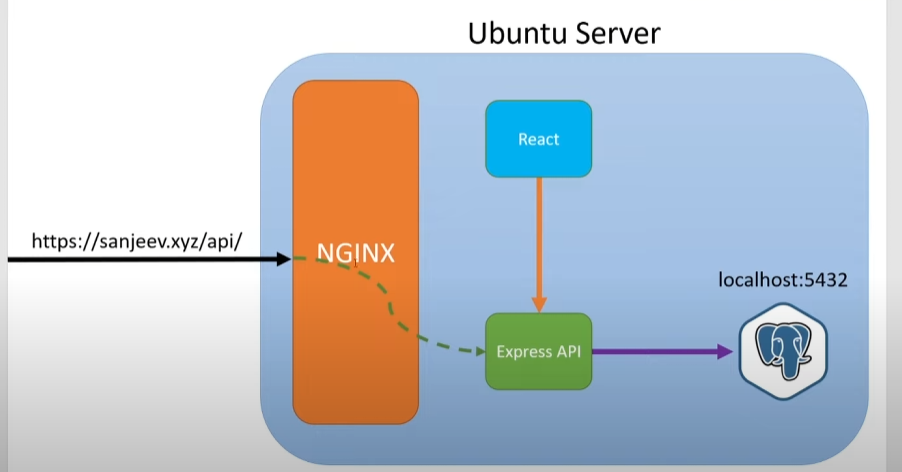

# What is NGINX?

NGINX is a web server and reverse proxy server software

- intermediary between clients and servers
- intercepting requests from clients and forwarding them to the appropriate servers
  
  

# Default server config file

change the root path to the build folder so that NGINX can find the index.html file build

change server
