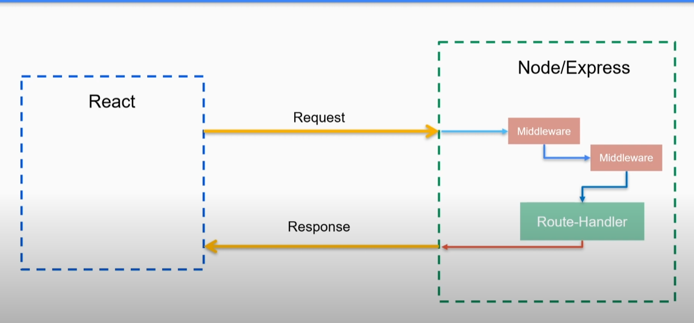
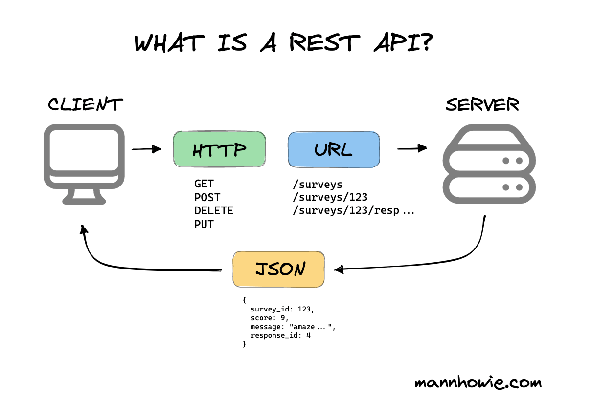
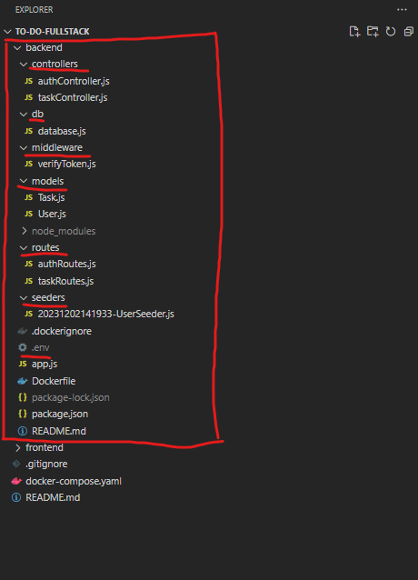
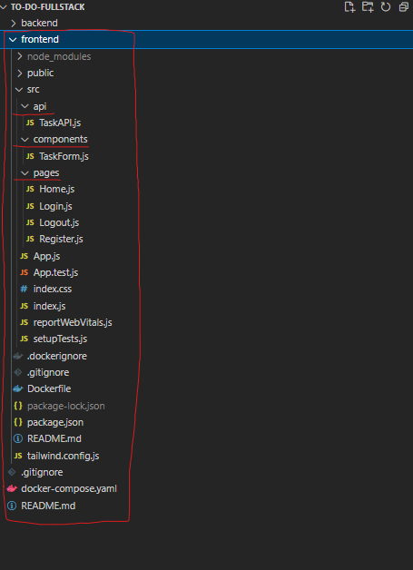
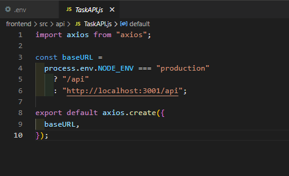

# What is full stack application?

A application that has:

- frontend (client) : handles UI
- backend (server) : business logic, and interactions with external systems such as databases

# How do they interact?



# What is middleware?



When frontend send requests to backend , there can be middleware can intercept the API request (eg. various tasks such as authentication, authorization, logging, data transformation)

# Backend



Example of env file storing db configs and others

```bash
DB_NAME=postgres
DB_USERNAME=postgres
DB_PASSWORD=123454
DB_HOST=localhost
DB_PORT=5432
JWT_EXPIRES_IN='6h'
JWT_SECRET='your-secret-key'
PORT='3001'
NODE_ENV='development'
```

# Frontend



Frontend API endpoints should be different in production vs development


